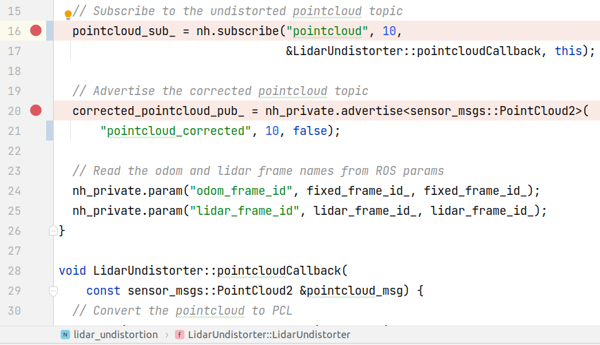
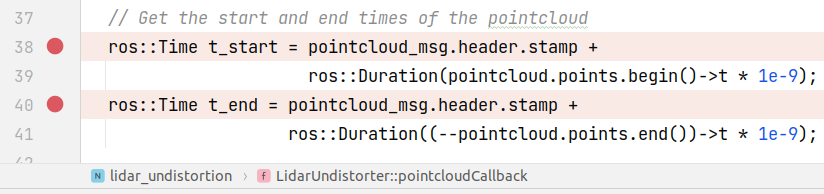

# arche_demo.launch 笔记

Github地址 https://github.com/ethz-asl/voxgraph


```bash
# 运行
roslaunch voxgraph arche_demo.launch rosbag_path:=${HOME}/catkin_ws/rosbag/arche_flight1_2ms_indoor-outdoor-figure-8.bag
```


## 运行时的bug

运行时出现一下问题:

`[ WARN] [1638089247.645120985, 1562071213.553981915]: Lookup would require extrapolation into the future.  Requested time 1562071203.743470848 but the latest data is at time 1562071186.794263808, when looking up transform from frame [os1_lidar] to frame [odom]`

issue区有人提出类似问题https://github.com/ethz-asl/voxgraph/issues/58, 但并没有解决方案.

- 将lidar msg的queue size调小后上述warning不再出现
- 具体细节:
  - 在`$(find lidar_undistortion)/lidar_undistortion/src/lidar_undistortion.cpp`中, 将图中两处的100改为10.
  - 

**\*TODO\***待解决


# 程序运行流程

`arche_demo.launch`运行了两个launch文件, 

- 处理lidar的失真 [os1_undistortion.launch](#os1_undistortion)
- `$(find lidar_undistortion)/launch/os1_undistortion.launch`
- voxgraph地图(主体程序) [voxgraph_mapper.launch](#voxgraph_mapper)
- `$(find voxgraph)/launch/voxgraph_mapper.launch`


## lidar_undistortion os1_undistortion.launch

<a name=os1_undistortion></a>

- 文件中将"pointcloud" remap到 "/penguin/os1_cloud_node/points"
  - 代码中用`pointcloud`代指点云的topic, launch文件中可以用具体的topic remap到`pointcloud`来让程序正确读取
- 运行的node在`$(find lidar_undistortion)/lidar_undistortion/src/lidar_undistortion.cpp`

## lidar_undistortion.cpp

参考阅读: https://zhuanlan.zhihu.com/p/413195019

- 

- 从topic `pointcloud`读取msg, 调用回调函数`pointcloudCallback()`
  - 读取的是原始点云
- 正确点云的pub topic是`pointcloud_corrected`

### pointcloudCallback()

- 
- 这次点云扫描的起始时间和结束时间
  - *扫描需要时间, 而车辆在一次扫描期间发生了移动, 所以需要知道扫描开始和结束的时间* 
- 


## voxgraph voxgraph_mapper.launch

<a name=voxgraph_mapper></a>

