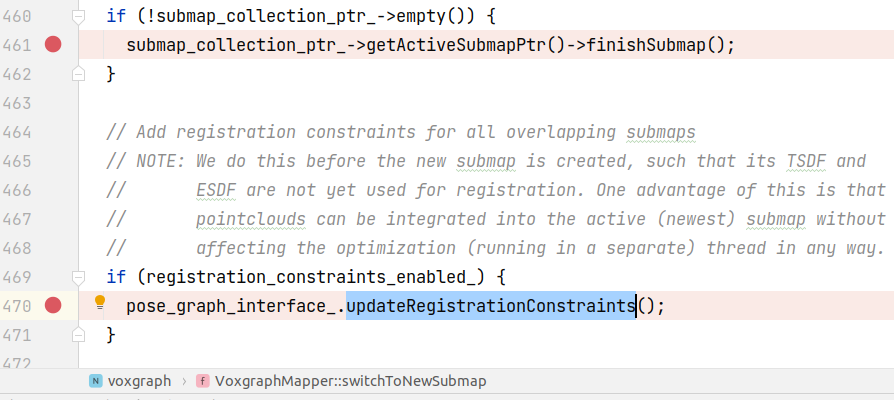
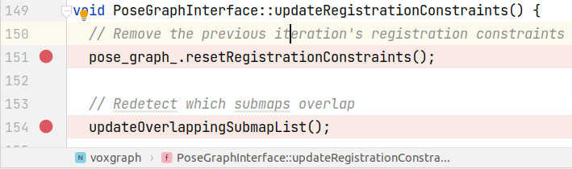
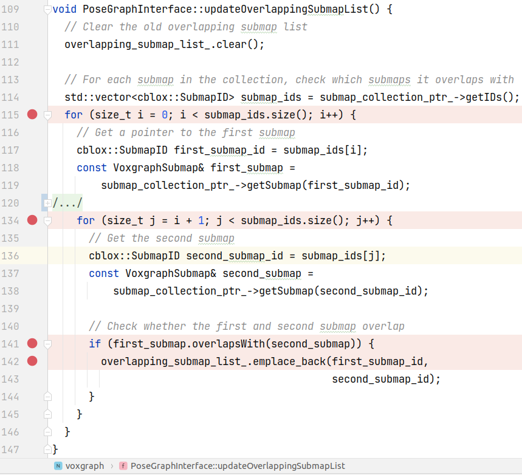
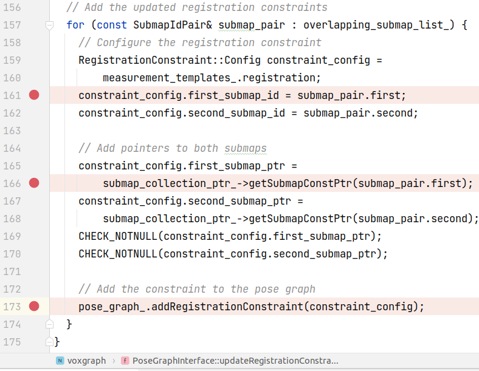
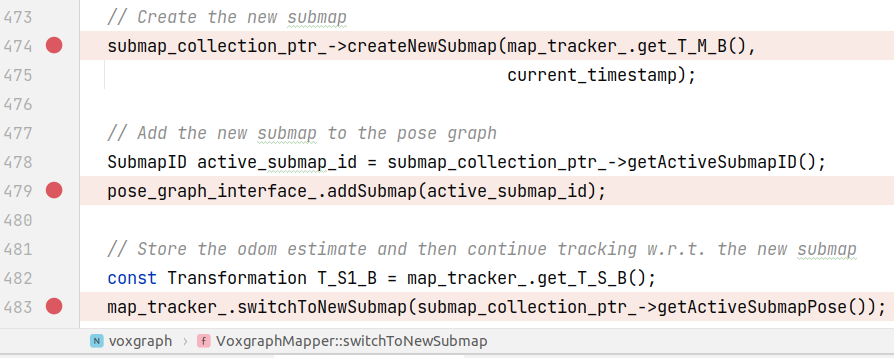
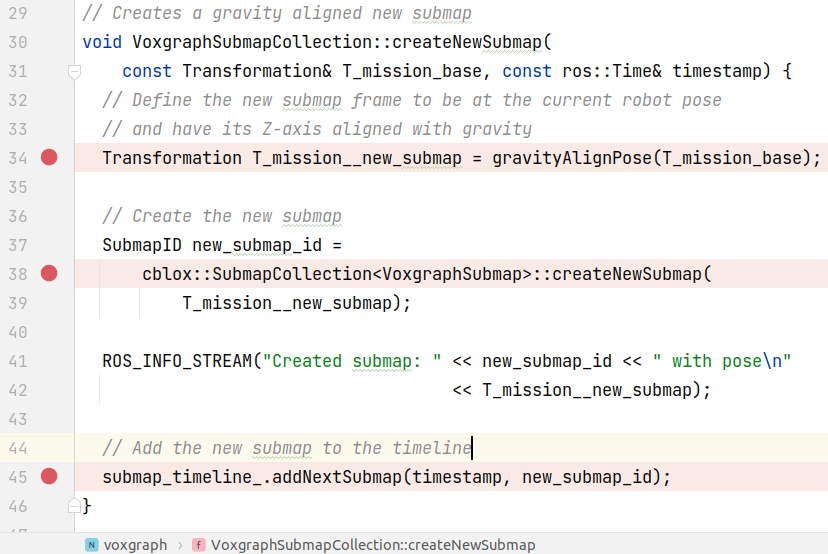
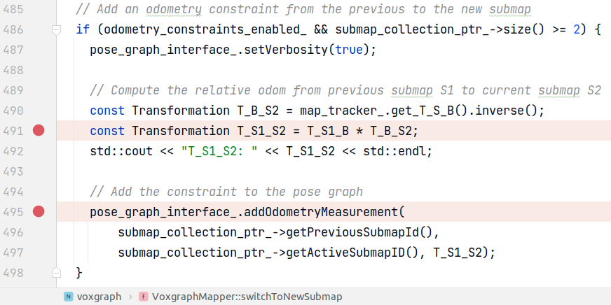
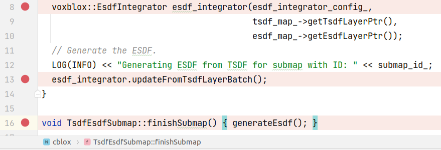
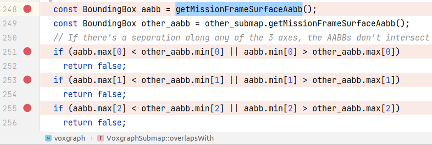

# arche_demo.launch 笔记

Github地址 https://github.com/ethz-asl/voxgraph


```bash
# 运行
roslaunch voxgraph arche_demo.launch rosbag_path:=${HOME}/catkin_ws/rosbag/arche_flight1_2ms_indoor-outdoor-figure-8.bag
```


## 运行时的bug

运行时出现一下问题:

`[ WARN] [1638089247.645120985, 1562071213.553981915]: Lookup would require extrapolation into the future.  Requested time 1562071203.743470848 but the latest data is at time 1562071186.794263808, when looking up transform from frame [os1_lidar] to frame [odom]`

issue区有人提出类似问题https://github.com/ethz-asl/voxgraph/issues/58, 但并没有解决方案.

- 将lidar msg的queue size调小后上述warning不再出现
- 具体细节:
  - 在`$(find lidar_undistortion)/lidar_undistortion/src/lidar_undistortion.cpp`中, 将图中两处的100改为10.
  - 

**\*TODO\***但运行一段时间后会卡死


# 程序运行流程

`arche_demo.launch`运行了两个launch文件, 

- 处理lidar的失真 [os1_undistortion.launch](#os1_undistortion)
- `$(find lidar_undistortion)/launch/os1_undistortion.launch`
- voxgraph地图(主体程序) [voxgraph_mapper.launch](#voxgraph_mapper)
- `$(find voxgraph)/launch/voxgraph_mapper.launch`


## lidar_undistortion os1_undistortion.launch

<a name=os1_undistortion></a>

- 文件中将"pointcloud" remap到 "/penguin/os1_cloud_node/points"
  - 代码中用`pointcloud`代指点云的topic, launch文件中可以用具体的topic remap到`pointcloud`来让程序正确读取
- odom_frame_id是`odom`, lidar_frame_id是`os1_lidar`
- 运行的node在`$(find lidar_undistortion)/lidar_undistortion/src/lidar_undistortion.cpp`

### lidar_undistortion.cpp

参考阅读: https://zhuanlan.zhihu.com/p/413195019

- 

- 从topic `pointcloud`读取msg, 调用回调函数[`pointcloudCallback()`](#pointcloudCallback)
  - 读取的是原始点云
- 正确点云的pub topic是`pointcloud_corrected`

#### pointcloudCallback()

<a name=pointcloudCallback></a>

- 
- 这次点云扫描的起始时间和结束时间
  - *扫描需要时间, 而车辆在一次扫描期间发生了移动, 所以需要知道扫描开始和结束的时间* 
- *头文件中解释说, 点云校正时, 每个点的记录的坐标系不相同, 代码中叫这个时刻S_correct. 需要把他们统一转换到一个坐标系下, 也就是这次扫描起始时刻的坐标系, 叫做scan frame(S_original). 可是我们并不能直接得到变换矩阵, 但我们有世界坐标系fixed frame(F)和S_correct的变换矩阵, 以及fixed frame(F) 和S_original的变换矩阵*
  - *某个固定的参考系叫 fixed frame, 比如世界坐标系*
  - *某次扫描的起始参考系叫S_original*
  - *该次扫描中 扫到某点时的参考系叫S_correct*
- 
- T_F_S_original: fixed frame和S_original的变换矩阵
- 
- 根据点的记录时间有没有变来判断是否需要更新变换矩阵
  - 根据时间确定F和S_correct的变换矩阵
  - 叠加F和S_original的变换矩阵， 得到S_original到S_correct的
- 把点变换到S_original坐标系下
- 生成msg, 并发布


## voxgraph voxgraph_mapper.launch

<a name=voxgraph_mapper></a>

- 运行node `voxgraph_mapper`, 位于`$(find voxgraph)/voxgraph/src/frontend/voxgraph_mapper.cpp`
  - 使用参数文件`$(find voxgraph)/voxgraph/config/voxgraph_mapper.yaml`

- 还有rviz的node(略)

### voxgraph_mapper.cpp

- 从ros拿参数`getParametersFromRos()`
  - 略
  - 如果`update_mesh_every_n_sec > 0`, 定时回调[`publishActiveSubmapMeshCallback()` ](#publishActiveSubmapMeshCallback)
- sub topic `subscribeToTopics()`

#### `pointcloudCallback()`

- 

  - 

  - `current_timestamp`: 点云msg的时间戳

  - 根据`current_timestamp`**更新`map_tracker_`**

    - **\*TODO\*** 补上详细解释
    - 更新`T_O_B_`, baselink到odom的transform
    - 更新`T_S_B_`, baselink到submap的transform
    - 更新`T_B_C_`, baselink到pointcloud的transform

  - 根据`current_timestamp`判断是否需要**生成新的submap**

    - `shouldCreateNewSubmap()`判断时间是否超出时间间隔(20)

    - *注意, 生成新的子地图前需要确认优化完成*

      - *生成新图会重置约束条件, 如果有未完成的优化会导致程序崩溃*

    - 

    - 把完成的子地图加入pose graph, 生成新的子地图`switchToNewSubmap()`  

      - 

      - 对当前活跃子地图做收尾工作 `submap_collection_ptr_->getActiveSubmapPtr()->`[`finishSubmap()`](#finishSubmap)

      - 更新配准约束`updateRegistrationConstraints()`

        -  
        - 重置配准约束, 清空`constraints_collection_`中的list`registration_constraints_`
        - 更新子地图的重叠部分`updateOverlappingSubmapList()`
          - 
          - 遍历所有配对 
            - i=0 : `submap_ids.size()`-1
            - j=i+1 : `submap_ids.size()`-1
          - 如果(i, j)有重叠[overlapsWith()](#overlapsWith), 加入`overlapping_submap_list_`
        - 
        - 遍历`overlapping_submap_list_`中的元素
          - 生成约束, 包含元素中的两个子地图的id和ptr
          - 把约束加入`pose_graph_`中

      - 

      - 生成新的子地图`createNewSubmap()`

        -  
        - 输入参数
          - 当前位姿`map_tracker_.get_T_M_B()`, 当前时间戳`current_timestamp`
        - 通过把机体位姿和重力方向对齐`gravityAlignPose()`, 得到给新的子地图的初始位姿`T_mission__new_submap`
          - 把位姿log成$[x, y, z, r, p, y]$
          - 把roll $r$和yaw $y$设置为0
          - exp回旋转矩阵, 得到和重力方向对齐的位姿
        - 生成子地图`cblox::SubmapCollection<VoxgraphSubmap>::createNewSubmap(T_mission__new_submap)`
          - **\*TODO\*** 搞清这段代码在哪 `$(find cblox)/cblox/include/cblox/core/submap_collection_inl.h`?
        - 把时间戳和新地图id加入`submap_timeline_`

      - 新的子地图id加入`pose_graph_`

      - 转换去新的子地图`switchToNewSubmap()`

      - 

      - 添加上一张子地图S1和新子地图S2之间的里程计约束

      - 计算S1和S2之间的变换矩阵

      - 添加里程计约束`addOdometryMeasurement()`

        - 

        

    

    

    - 发布当前子地图mesh`publishActiveSubmapMeshCallback()`<a name=publishActiveSubmapMeshCallback></a>
      -  
    - 回调优化位姿图`optimizePoseGraph()`
      -  
    - 发布地图`publishMaps()`
      -  
    - 

#### `loopClosureCallback()`

- 发布topic advertiseTopics()`
  - 略
- 发布service `advertiseServices()`
  - `publishSeparatedMeshCallback()`
  - `publishCombinedMeshCallback()`
  - `optimizeGraphCallback()`
  - `finishMapCallback()`
  - `saveToFileCallback()`
  - `savePoseHistoryToFileCallback()`
  - `saveSeparatedMeshCallback()`
  - `saveCombinedMeshCallback()`
  - `saveOptimizationTimesCallback()`
- 


### voxgraph_submap.cpp

`$(find cblox)/cblox/src/core/tsdf_esdf_submap.cpp`

#### `finishSubmap()`

<a name=finishSubmap></a>

- 
- `generateEsdf()`
  - 创建一个新的`EsdfIntegrator`
    - **\*TODO\*** voxblox esdf_integrator
  - 调用`.updateFromTsdfLayerBatch()`
    - **\*TODO\***

#### overlapsWith(const VoxgraphSubmap& other_submap)

<a name=overlapsWith></a>

-  
- `getMissionFrameSurfaceAabb()`获得自身和比较目标(另一个子地图)的轴对齐碰撞箱(AABB) `aabb`, `other_aabb`
  - 调用函数`getAabbFromObbAndPose()`需要两个参数
    - `getSubmapFrameSurfaceObb()`得到子地图的有向碰撞箱`obb`
      - 遍历该子地图里的每个block的每一个voxel, 找到[*x, y, z*]的最大值和最小值
    - `getPose()`得到位姿`pose`
      - T_M_S 活跃子地图的优化后位姿
  - 将`obb`的八个顶点用`pose`变换到世界坐标系下, 求出`AABB`
    - *个人理解, OBB是在地图的局部坐标系下的沿XYZ轴的碰撞箱, OBB变换到世界坐标系下后, 它(的边和面)不再沿着坐标轴, 所以在外面再套一个沿轴的碰撞箱, 也就是AABB*
    - *OBB中的有**向**指的是地图**局部坐标轴的方向**, AABB中的**轴**对齐指的是和**世界坐标系的坐标轴**对齐*
- 快速判断AABB没有重合: 一个轴坐标的最大值小于另一个的最小值
- 遍历子地图中的所有block, 转换到另一个子地图`other_submap`, 判断是否在`other_submap`上, 有则return true
- 所有block都不在`other_submap`上, return false

